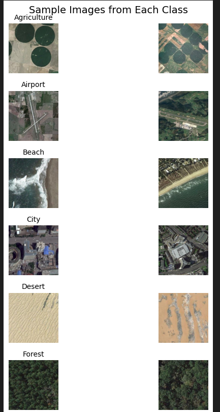
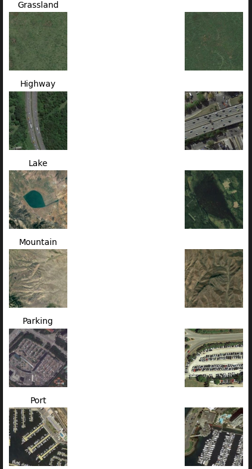
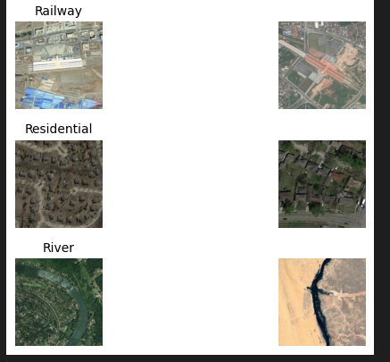
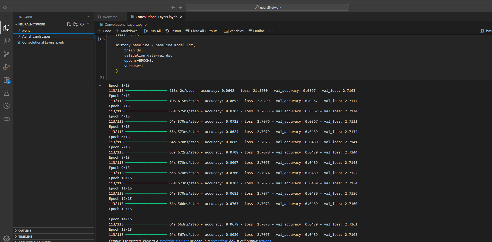
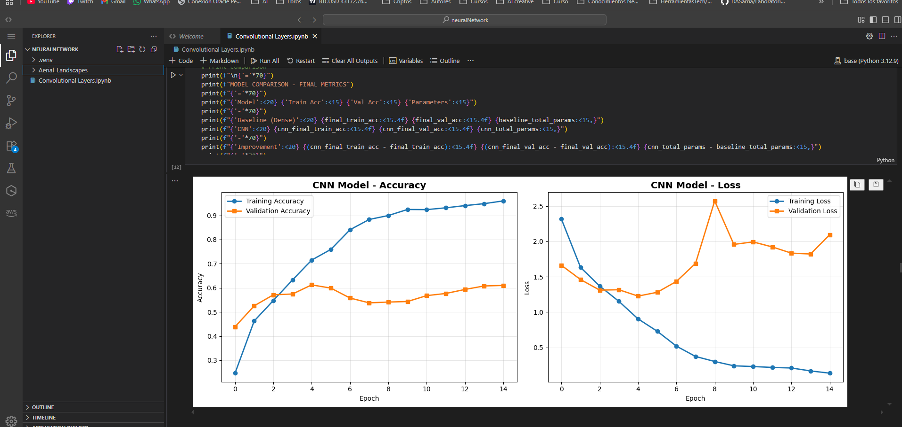

# Convolutional Neural Networks - Aerial Landscapes Classification

## Project Overview

This project implements and analyzes convolutional neural networks (CNNs) for classifying aerial landscape images. The work demonstrates understanding of CNN architecture design, the role of inductive bias in deep learning, and the advantages of convolutional layers over fully connected networks for image data.

Through systematic experimentation, this project compares baseline fully connected architectures against custom CNN designs, conducts controlled experiments on architectural choices (kernel size comparison), and provides detailed analysis of why CNNs excel at image classification tasks.

## Dataset

**Name**: Aerial Landscapes Dataset  
**Classes**: 15 landscape categories
- Agriculture
- Airport
- Beach
- City
- Desert
- Forest
- Grassland
- Highway
- Lake
- Mountain
- Parking
- Port
- Railway
- Residential
- River

**Dataset Statistics**:
- **Total Images**: 4,500 (300 per class)
- **Image Dimensions**: 256×256×3 (RGB)
- **Distribution**: Perfectly balanced dataset
- **Split**: 80% training (3,600 images) / 20% validation (900 images)

**Source**: Local dataset organized in class-based directories  
**Format**: RGB images at 256×256 resolution





### Dataset Justification

This dataset is appropriate for convolutional neural networks because:

1. **Spatial Structure**: Aerial images contain strong spatial patterns and textures that CNNs are designed to capture
2. **Translation Invariance**: Landscape features can appear at different positions in the image, requiring translation-invariant feature detection
3. **Hierarchical Features**: CNNs can learn hierarchical representations from low-level textures to high-level landscape structures
4. **Color Information**: RGB channels provide crucial information for distinguishing landscape types (e.g., water vs. vegetation vs. urban areas)
5. **Sufficient Data**: 4,500 balanced images provide adequate training data for CNN architectures

## Project Structure

```
neuralNetwork-ai-infrastructure/
├── Aerial_Landscapes/          # Dataset directory
│   ├── Agriculture/
│   ├── Airport/
│   └── ...
├── Convolutional Layers.ipynb  # Main implementation notebook
└── README.md
```

## Implementation Tasks

### 1. Dataset Exploration (EDA) ✅

- [x] Dataset size and class distribution analysis
- [x] Image dimensions and channels inspection
- [x] Sample visualization from each class
- [x] Preprocessing requirements identification

**Key Findings**: 
- Perfectly balanced dataset with 300 images per class
- All images are 256×256×3 RGB format
- Clear visual distinctions between classes visible through texture, color, and spatial patterns

### 2. Baseline Model (Non-Convolutional) ✅

- [x] Flatten + Dense architecture implementation
- [x] Training and validation performance
- [x] Parameter count analysis
- [x] Limitations documentation

**Architecture**: Input (256×256×3) → Flatten → Dense(512) → Dropout(0.5) → Dense(256) → Dropout(0.5) → Dense(15)

**Results**:
- **Parameters**: 100,798,991
- **Training Accuracy**: 6.94%
- **Validation Accuracy**: 4.89%
- **Conclusion**: Model fails to learn meaningful patterns, demonstrating the critical need for spatial structure preservation

### 3. Convolutional Architecture Design ✅

- [x] Custom CNN architecture design
- [x] Architectural decisions justification:
  - Number of convolutional layers
  - Kernel sizes (3×3)
  - Stride and padding choices
  - Activation functions (ReLU)
  - Pooling strategy (MaxPooling 2×2)
- [x] Implementation and training
- [x] Performance comparison with baseline

**Architecture**: 3 Convolutional blocks (32→64→128 filters) with 3×3 kernels, MaxPooling, followed by Dense(256) → Dropout → Dense(15)

**Results**:
- **Parameters**: 33,651,791 (66.61% fewer than baseline)
- **Training Accuracy**: 96.00%
- **Validation Accuracy**: 61.00%
- **Improvement over Baseline**: +56.11% validation accuracy

### 4. Controlled Experiments ✅

- [x] Kernel size comparison (3×3 vs 5×5)
- [x] Performance analysis
- [x] Parameter efficiency evaluation
- [x] Training dynamics comparison

**Experiment**: Identical architecture with different kernel sizes

**Results**:
| Model | Parameters | Train Acc | Val Acc | Overfitting Gap |
|-------|-----------|-----------|---------|----------------|
| CNN 3×3 | 33,651,791 | 96.00% | 61.00% | 35.00% |
| CNN 5×5 | 33,817,167 | 93.81% | 54.89% | 38.92% |

**Conclusion**: 3×3 kernels outperform 5×5 kernels despite minimal parameter increase (+0.49%), demonstrating superior generalization and efficiency.

### 5. Architectural Interpretation ✅

- [x] Analysis of why CNNs outperform baseline
- [x] Identification of inductive biases
- [x] Discussion of when NOT to use CNNs
- [x] Final reflections on learning outcomes

## Experimental Results

### Model Performance Summary

| Model | Parameters | Train Acc | Val Acc | Train Loss | Val Loss | Performance |
|-------|-----------|-----------|---------|------------|----------|-------------|
| **Baseline (Dense)** | 100,798,991 | 6.94% | 4.89% | 2.634 | 2.655 | ❌ Failed |
| **CNN 3×3** | 33,651,791 | 96.00% | 61.00% | 0.136 | 2.095 | ✅ Best |
| **CNN 5×5** | 33,817,167 | 93.81% | 54.89% | 0.220 | 2.103 | ⚠️ Good |

### Key Observations

1. **CNN vs Baseline**: The CNN dramatically outperforms the baseline model while using 66.61% fewer parameters, demonstrating the power of architectural inductive bias for image data.

2. **Kernel Size Comparison**: Smaller 3×3 kernels achieve better performance than 5×5 kernels with:
   - 6.11 percentage points higher validation accuracy
   - Lower overfitting gap (35% vs 38.92%)
   - Better training convergence
   - Only 0.49% more parameters

3. **Parameter Efficiency**: CNNs achieve superior results with fewer parameters through:
   - Weight sharing across spatial locations
   - Local connectivity respecting spatial structure
   - Hierarchical feature learning

## Main Conclusions

### Why CNNs Excel at Image Classification

1. **Spatial Structure Preservation**: Unlike flattening operations, convolutional layers maintain the 2D structure of images, preserving relationships between neighboring pixels.

2. **Translation Invariance**: The same filter detects features regardless of position, enabling the model to recognize patterns anywhere in the image.

3. **Hierarchical Feature Learning**: Stacked convolutional layers build features progressively:
   - Early layers: edges, colors, basic textures
   - Middle layers: shapes, patterns, geometric structures
   - Deep layers: complex objects and scene components

4. **Parameter Efficiency Through Weight Sharing**: A single 3×3 filter (9 parameters) is applied across the entire image, versus fully connected layers that require separate weights for each pixel position.

### Inductive Biases of Convolutional Layers

CNNs embed three key assumptions:

1. **Locality**: Nearby pixels are more related than distant ones
2. **Stationarity**: Useful features can appear at any location
3. **Compositionality**: Complex patterns are built from simpler ones

These assumptions perfectly match natural image statistics, making CNNs highly effective for vision tasks.

### When NOT to Use CNNs

Convolutional layers are inappropriate for:

1. **Tabular Data**: Features without spatial relationships (e.g., house prices with unrelated columns)
2. **Long-Range Dependencies**: Text or sequences where distant elements are critically related
3. **Position-Critical Tasks**: When exact location matters (e.g., medical imaging where organ position is diagnostic)
4. **Small Datasets**: Without spatial structure or insufficient data to learn hierarchical patterns
5. **Irregular Time Series**: Data collected at non-uniform intervals

### Experimental Insights

The kernel size experiment revealed that:

- **Smaller kernels (3×3) are preferred** because:
  - More parameter efficient
  - Allow stacking for larger effective receptive fields
  - Introduce more non-linearities (ReLU between layers)
  - Better generalization with less overfitting
  
- **This explains modern architectures** (VGG, ResNet) predominantly use 3×3 kernels

## Requirements

```
Python 3.x
tensorflow >= 2.0
numpy
matplotlib
PIL (Python Imaging Library)
```
## Tests in Sagemaker





## Author

David Sarria  
February 2026
